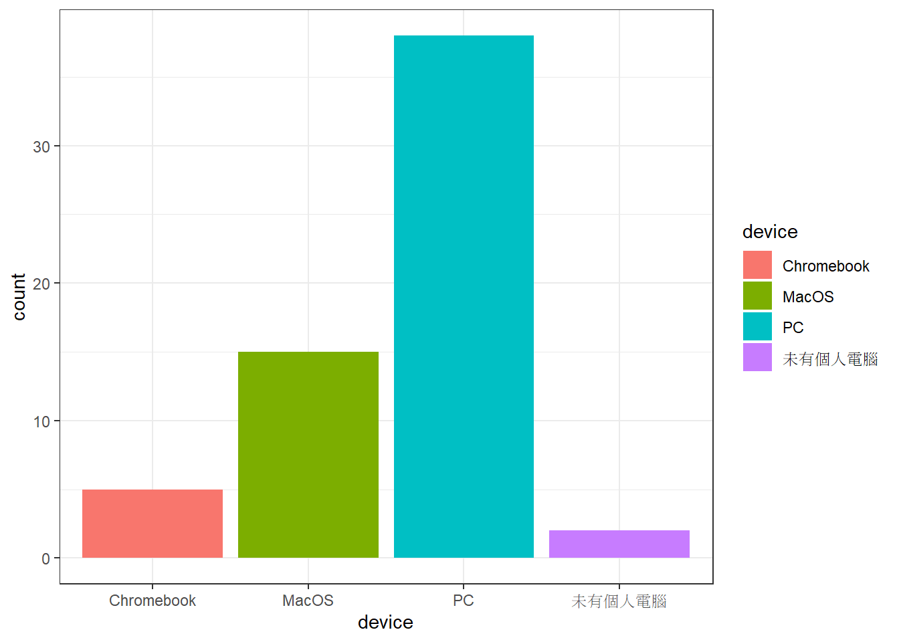
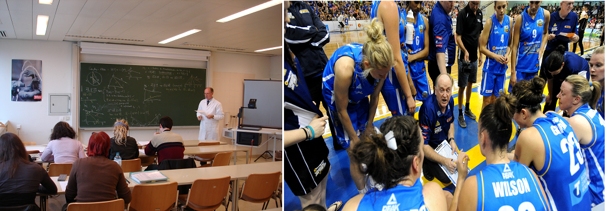

# 00_0916從資料科學基本功開始的理由

## 為何心理學需要統計？

- [統計思考](https://nobaproject.com/modules/statistical-thinking#content)是所有領域心理學家的通識能力。
- 現代任何心理學主張都是建立在**可被檢驗**的資料，可被檢驗的資料都有**不確定性**。

> 你能多快唸出這些字？
> **軸**, **濘**, **喙**

> 你能回憶這些時間點你在什麼地方?
> 昨天此時? 十四天之前此時? 三十天之前此時? 

- **統計學** 評估與說明資料**不確定性**的現時技術。

## 2020世代學好統計的標準？

- 以明確的問題意識理解資料存在的意義
- 善用資料處理工具
- 運用視覺化模組解析資料的機率特徵: 平均數、標準差、相關、廻歸模型

(\#fig:plot-device)課前個人設備調查

調查至2021-09-15 16:30:49，共有60位同學回覆，7位同學使用Chromebook或沒有自己的設備。

## 可重製統計是什麼？

- 瀏覽[Level 1電子書](https://rstat-project.github.io/ug1-practical/)，簡介單元安排

- 傳統的心統 vs. 可重製的心統

## 課程講授及作業演練模式

- 配合[教學方法](https://rstat-project.github.io/syllabus.html#%E6%95%99%E5%AD%B8%E6%96%B9%E6%B3%95-teaching-strategies)說明

||模式A|模式B|
|:---:|:---|:---|
|單元範圍| 1 - 8 | 9 - 15 |
|課前|完成前次單元作業 獲得作業回饋|觀看示範錄影、自行練習|
|上課時間|領取作業 依單元內容講授示範 課堂練習|領取作業 說明作業達成目標 完成單元作業|
|課後|完成單元作業 [討論區](https://github.com/Rstat-project/ug1-practical/discussions)提問或分享心得|[討論區](https://github.com/Rstat-project/ug1-practical/discussions)提問或分享心得|

## Hello! git and github

- 註冊github帳號：github帳號是值得經營一輩子的社群帳號，建議設定有個人特色的帳號名稱與頭像。**上課前已經註冊並已造訪github classroom的同學，想更改名稱者請在今日課程結束後進行。**

- 休息時間15分鐘~請正式修課同學在[討論區](https://github.com/Rstat-project/ug1-practical/discussions)的"Hello 第一次上課"帖子回覆留言，測試自已的github帳號能正常運作，順便互相認識修課同學。

**待加選同學與胡中凡老師另開會議室討論**

- 從[github classroom](https://classroom.github.com/classrooms/88956273-rstat-project-ncku-2021fall)領取作業"Hello! git and github"

- 依照使用設備分組，跟著老師/助教演練作業領取與繳交步驟:clone repo, commit作業存檔, push作業存檔

> Windonws

> MacOS

> Rstudio Cloud(chromebook, 使用公用電腦)

**Rstudio設定將在第三週有詳細介紹與作業演練，開場作業是協助同學熟練基本操作與檔案管理，只要了解如何使用Rstudio處理作業複本**

- 下課前: 本機學習筆記、作業檔案[管理建議](https://rstat-project.github.io/ug1-practical/githubclassroom.html#%E4%BD%9C%E6%A5%AD%E8%B3%87%E6%96%99%E7%AE%A1%E7%90%86%E8%B3%87%E6%96%99%E5%A4%BE%E8%A8%AD%E7%BD%AE%E5%BB%BA%E8%AD%B0)

